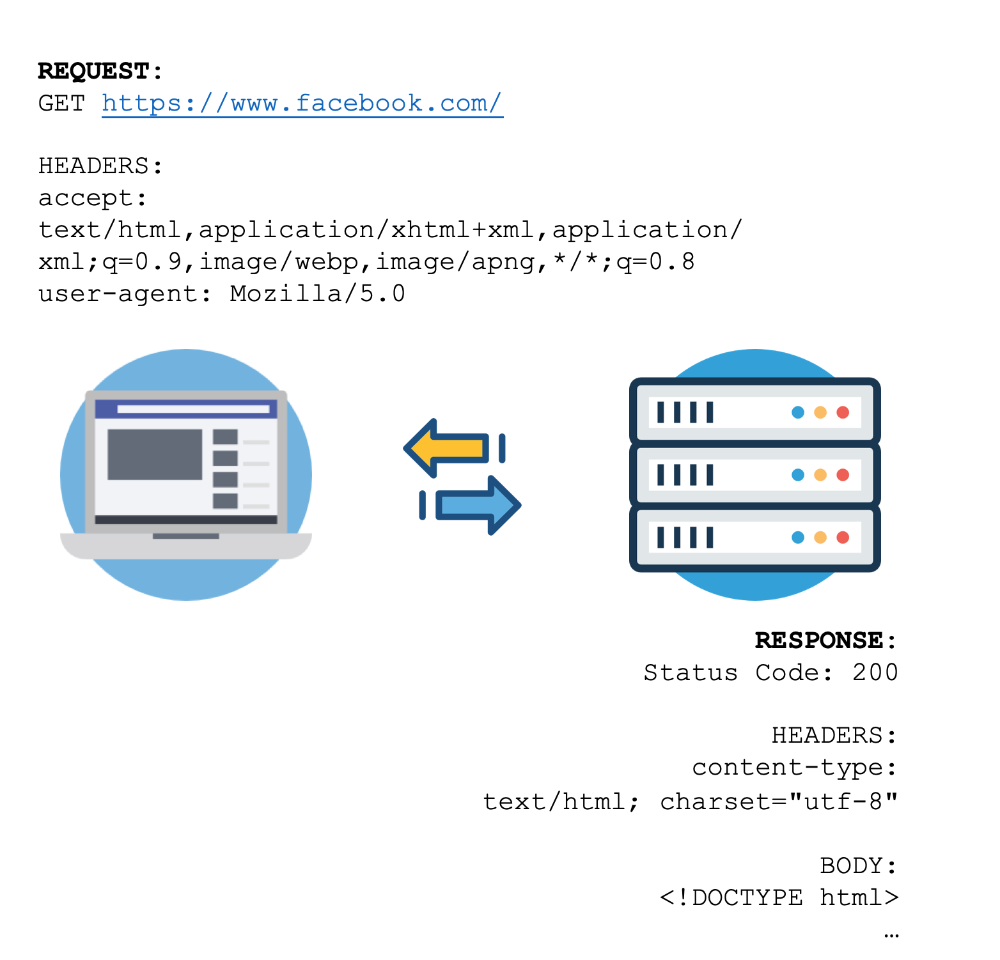
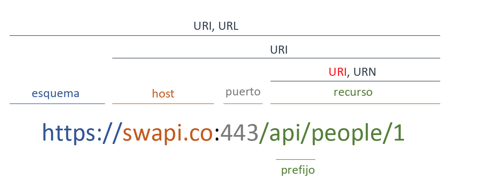
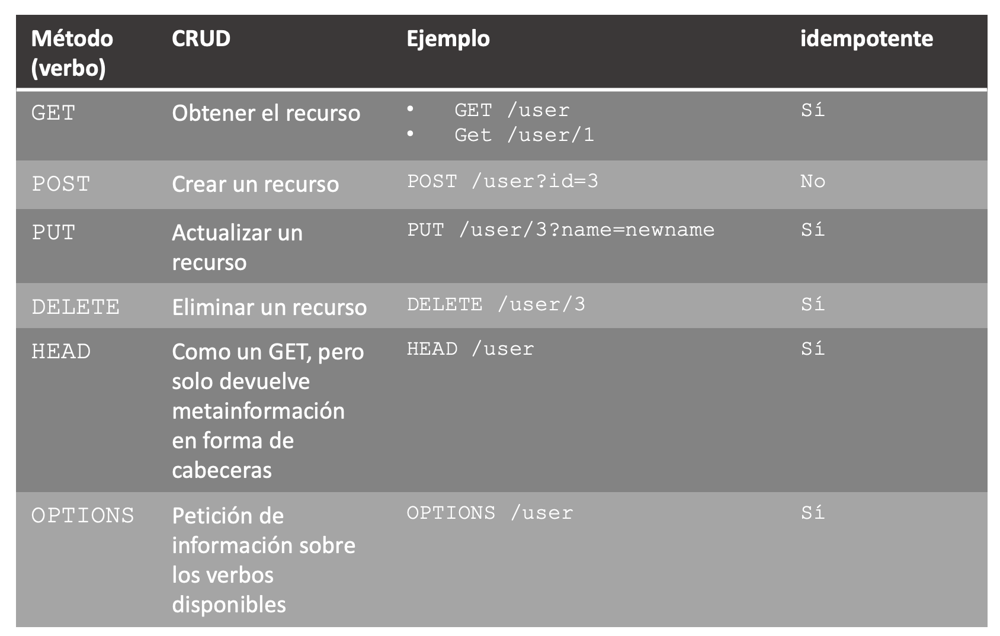

# Introducción a las APIs

Vamos a estudiar las API's, que son una forma de comunicación entre aplicaciones. Que mejor manera de empezar que viendo un ejemplo:

```bash
curl -XGET https://catfact.ninja/fact | jq -r .fact
```

---
<!-- _header: API's -->

## Objetivos

- Conocer formas de comunicación con servicios *backend*
- Aprender los principios básicos de `REST`
- Desarrollar una pequeña API con Python
- Aprender a probar APIs/URLs HTTP con Postman

---
<!-- _header: API's -->
<!-- _class: smaller-ul -->

## Índice de Contenido

- [Introducción a las APIs](#introducción-a-las-apis)
  - [Objetivos](#objetivos)
  - [Índice de Contenido](#índice-de-contenido)
  - [¿Qué son las API's?](#qué-son-las-apis)
  - [Tipos de arquitecturas de APIs](#tipos-de-arquitecturas-de-apis)
    - [SOAP](#soap)
    - [RPC](#rpc)
    - [REST](#rest)
    - [Ejemplos de APIs públicas en internet](#ejemplos-de-apis-públicas-en-internet)
  - [REST](#rest-1)
    - [Características](#características)
    - [Elementos de HTTP](#elementos-de-http)
    - [Recursos REST](#recursos-rest)
    - [CRUD en REST](#crud-en-rest)
    - [Cuerpo de las peticiones/respuestas en REST](#cuerpo-de-las-peticionesrespuestas-en-rest)
    - [Ventajas de las APIs REST](#ventajas-de-las-apis-rest)
  - [Desarrollando una API con Python y Flask](#desarrollando-una-api-con-python-y-flask)
    - [Características](#características-1)
    - [Instalación](#instalación)
    - [Creación de un endpoint](#creación-de-un-endpoint)
    - [Añadir más endpoints](#añadir-más-endpoints)
  - [Postman](#postman)
    - [Características](#características-2)
    - [Enlaces útiles de la documentación](#enlaces-útiles-de-la-documentación)
  - [Ejercicios Opcionales](#ejercicios-opcionales)
    - [Ejemplo CRUD: Usuarios y Películas](#ejemplo-crud-usuarios-y-películas)
    - [Ejemplo Testing: Postman](#ejemplo-testing-postman)
  - [Ejercicio obligatorio](#ejercicio-obligatorio)

---

## ¿Qué son las API's?

*Application Program interface*. Es una interfaz de comunicación a un componente de software (una serie de funciones por ejemplo) que define como se debe usar ese componente. De forma más práctica podemos verlo como una serie de métodos de un programa pensados para ser ejecutados desde otro programa.

---
<!-- _header: Que son las API's -->

A menudo las APIs se refieren por lo general A Web APIs, que permiten la comunicación con servicios web a través del protocolo `HTTP`.

En esta asignatura con el término API, nos estaremos refiriendo a Web APIs. Las Web APIs, siguiendo una estructura básica de cliente servidor, se encuentran en la parte servidor, de forma que el código cliente (*frontend* si se ejecuta en un terminal de usuario o *middleware* si se ejecuta en un servidor *on-premise* de un cliente) va a poder llamar a métodos del servidor.

---
<!-- _header: Que son las API's -->

A diferencia del modelo tradicional de programación web (por ejemplo en `PHP`), que ejecuta el código y renderiza las vistas en la parte servidora, mediante el uso de Web APIs se puede separar totalmente la ejecución y renderización de la vista (código *frontend*) respecto al código de servidor. Para ello se utilizan distintas estructuras de datos (`JSON`, `XML`...) para transmitir la información necesaria sobre el protocolo `HTTP`.

---
<!-- _header: Que son las API's -->

Esto mismo se puede trasladar al paso de información de tipo *M2M* o *Machine to Machine* que haría referencia a la transmisión de información de un servidor a otro.

Al igual que como ocurre con `PHP`, las APIs necesitan un servidor para ser expuestas y poder ser llamadas. Uno de los servidores más habituales en Python es Gunicorn (<https://gunicorn.org>).

---
<!-- _header: Que son las API's -->

**En resumen, las API's son un protocolo de comunicación entre dos programas.**

---

## Tipos de arquitecturas de APIs

Hay tres tipos de arquitecturas de APIs: `SOAP`, `RPC` y `REST`. Vamos a ver brevemente las características de cada una de ellas, aunque finalmente nos centraremos en la arquitectura `REST` (visto que es la más utilizada actualmente).

---
<!-- _header: Tipos de arquitecturas API's -->

### SOAP

Una API SOAP es un protocolo de mensajería basado en XML para intercambiar información en una red, específicamente en el desarrollo de aplicaciones web.

- Requiere el uso de una librería SOAP
- No soportado por todos los lenguajes
- Expone llamadas a métodos
- Requiere el uso de XML
- Todas las llamadas se realizan mediante el método POST de `HTTP`
- Puede ser con estado (stateful) o sin estado (stateless)
- Muy difícil de usar por los desarrolladores

---
<!-- _header: Tipos de arquitecturas API's -->
<!-- _class: small-ul -->

### RPC

Una API RPC (Remote Procedure Call) es un protocolo que permite a un programa ejecutar un procedimiento o función en una máquina remota, como si estuviera siendo ejecutado localmente.

- Altamente acoplado
- Puede devolver cualquier formato
- Requiere que el cliente conozca los nombres de los procedimientos
- Requiere parámetros y orden específicos
- Requiere una URI diferente por cada método
- Típicamente utiliza `GET` y `POST`
- Requiere una extensiva documentación
- Sin estado
- Fácil de empezar a usarse por los desarrolladores
- Se utiliza a menudo para implementar servicios distribuidos en una red.

---
<!-- _header: Tipos de arquitecturas API's -->

### REST

Una API REST (Representational State Transfer) es un estilo arquitectónico para el diseño de aplicaciones web que utiliza el protocolo HTTP para recibir y enviar datos.

- No necesita librerías, utiliza `HTTP`
- Devuelve datos, sin exponer métodos
- Soporta cualquier tipo de `Content-Type`, `JSON` es el más usado
- Permites múltiples acciones por recurso
- Utiliza los verbos `HTTP` (GET, POST, PUT, DELETE, etc.)
- Sin estado
- Algo más difícil de usar por los desarrolladores
- La más común

---

### Ejemplos de APIs públicas en internet

- The Star Wars API: <https://swapi.co>
- Pokemon API: <https://pokeapi.co>
- ~~Twitter API: <https://developer.twitter.com/en/docs>~~ RIP

---

## REST

REpresentational State Transfer. Como hemos dicho anteriormente, es un estilo arquitectónico para el diseño de aplicaciones web que utiliza el protocolo HTTP para recibir y enviar datos. Toda la comunicación está basado en el protocolo HTTP.

---
<!-- _header: REST -->

### Características

- `HTTP`: Hyper Text Transfer Protocol
- Protocolo de la capa de aplicación
- Pensado para comunicación cliente – servidor
- Es un protocolo sin estado (el servidor no guarda información de los clientes).

---
<!-- _header: REST -->

Si os preguntais como se hace para que el servidor sepa que cliente es el que está haciendo la petición, se hace mediante la autenticación. La autenticación es un proceso que se realiza antes de que el cliente pueda hacer una petición al servidor. En este proceso el cliente envía sus credenciales al servidor y el servidor comprueba si son correctas. Si son correctas, el servidor devuelve un token de autenticación que el cliente debe enviar en cada petición que haga al servidor. Este token es un identificador único que el servidor utiliza para saber que cliente es el que está haciendo la petición.

---
<!-- _header: REST -->



---
<!-- _header: REST -->

### Elementos de HTTP

Verbos:

- `GET`
- `POST`
- `PUT`
- `DELETE`
- ...

---
<!-- _header: REST: Elementos HTTP -->

Enlaces a recursos -> Ejemplo: <https://www.facebook.com/user>

Cabeceras: Permiten enviar informaicón adicional sobre la petición/respuesta: Ejemplo: `'Content-type: application/json'`

---
<!-- _header: REST -->

Cuerpo de la petición: Se utiliza para enviar el 'payload', todo lo que no cabe como parte de http (cabeceras, verbos, enlaces a recursos, etc.)

Además se usan códigos de error:

- `500`+: Error en el servidor
- `400`-`499`: Error en la petición
- `300`-`399`: Códigos de redirección
- `200`-`299`: Códigos de éxito

---
<!-- _header: REST -->

### Recursos REST

Las APIs `REST` definen recursos, los cuales son accesibles mediante las URIs



---
<!-- _header: REST -->

En la imagen anterior la URI es `/api/people/1` y el recurso es `people` o personas, de forma que el número `1` es el identificador de la persona.

---
<!-- _header: REST -->

### CRUD en REST

En la tabla se puede observar como se utilizan los verbos HTTP para realizar operaciones de tipo CRUD sobre el recurso `user`

---



---
<!-- _header: REST -->

### Cuerpo de las peticiones/respuestas en REST

Lo más habitual es que las APIs soporten distintos métodos de comunicación como por ejemplo:

- `application/xml`
- `application/json`

---
<!-- _header: REST -->

Por su sencillez, y por que es lo más común nosotros vamos a trabajar con objetos `JSON`.

Ejemplo:

```JSON
{
  "users": [
    {
      "id": 1,
      "name": "Luke Skywalker"
    },
    {
      "id": 2,
      "name": "Han Solo"
    }
  ]
}
```

---
<!-- _header: REST -->

### Ventajas de las APIs REST

- La separación entre el cliente y servidor hace que las aplicaciones sean más escalables y fáciles de desplegar
- Independientes de la plataforma o el lenguaje
- Perfecto para aplicaciones que se comunican entre ellas
- Fácil de integrar en contenedores como Docker o LXC

---

## Desarrollando una API con Python y Flask


Flask es un Framework de Python con el que se pueden crear APIs de una forma rápida y sencilla.

Sitio Oficial y documentación: <https://flask.palletsprojects.com/en/>

---
<!-- _header: Flask -->

### Características

- Python
- Framework ligero
- Fácil de utilizar
- Incorpora un servidor para pruebas (no recomendado para producción)
- Open Source
- Github: <https://github.com/pallets/flask>
- Página oficial: <https://palletsprojects.com/p/flask/>

---
<!-- _header: Flask -->

### Instalación

```shell
sudo apt install python-pip
sudo pip install Flask
```

---
<!-- _header: Flask -->

### Creación de un endpoint

*`app.py`*

```python
from flask import Flask  
app = Flask(__name__)

@app.route('/')
def index():
    return 'Hello World!'
```

---
<!-- _header: Flask -->

Ejecución:

Para lanzar la aplicacion, desde la carpeta donde se encuentra `app.py`:

```shell
$ FLASK_APP=app.py flask run
 * Running on http://localhost:5000/
```

---
<!-- _header: Flask -->

Otra opción es:

```shell
$ python3 app.py
 * Running on http://localhost:5000/
```

---
<!-- _header: Flask -->

En otra terminal

```shell
curl http://localhost:5000
```

De la misma forma en el navegador puedes acceder a: `http://localhost:5000`

---
<!-- _header: Flask -->

### Añadir más endpoints

*`app.py`*

```python
from flask import Flask
from flask import Response
import json

app = Flask(__name__)

@app.route('/user', methods=['GET'])
def get_users():
  all_users = _get_all_users()
  return (Response(json.dumps(all_users), status=200,
  mimetype='application/json'))

@app.route('/user/<name>', methods=['GET'])
def get_user_by_name(name):
  user = _get_user_by_name(name)
  return (Response(json.dumps(user), status=200,
  mimetype='application/json'))

@app.route('/user', methods=[‘POST’])
def create_user():
  if request.is_json:
    data = request.get_json()
    print(data)
    # creo el usuario nuevo con data
    # ...
    return (Response(status=200, mimetype='application/json'))
  else:
    return (Response(status=403, mimetype='application/json’))
```

---
<!-- _header: Flask -->

Para probar la api desde la terminal se puede utilizar el programa `curl`

```shell
# Para hacer un GET
$ curl –XGET https://localhost:5000/user

# Ejemplo de POST contra httpbin
$ curl -X POST -d '{ "user": "prueba"}' "https://localhost:5000/user" -H "accept: application/json"

```

Existen servicios online como HTTPBin <https://httpbin.org> muy útiles para pruebas.

---

## Postman

Postman es la herramienta gráfica definitiva para trabajar con APIs. Puedes obtenerlo en el siguiente enlace. <https://www.getpostman.com/downloads>

---
<!-- _header: Postman -->

### Características

- Gestión de peticiones (*Requests*)
- Colecciones de peticiones
  - Ejecución periódica
  - Mocks
- Entornos
- Workspaces colaborativos
  - Personal
  - Team
  - Private
- Variables para colecciones/entornos
- Import / Export de colecciones
- Permite guardar las peticiones también entre diferentes lenguajes
- Captura de Peticiones
- Historial de actividad

---
<!-- _header: Postman -->


---
<!-- _header: Postman -->

### Enlaces útiles de la documentación

La documentación de Postman es muy amplia y está muy bien desarrollada. Se puede aprender mucho sobre como funciona HTTP siguiendo esta documentación.

Enlace a la documentación: <https://learning.postman.com/docs/postman/sending-api-requests/requests/>

---

## Ejercicios Opcionales

Para estos ejercicios te recomendamos el uso de Flask, Postman y CURL.

---

### Ejemplo CRUD: Usuarios y Películas

Vamos a realizar la creación de una API en Python con Flask que gestione usuarios y películas (CRUD)

1. No es necesario utilizar una base de datos. Con el uso de diccionarios y listas de Python es suficiente para guardar datos.
2. La API debe cumplir los principios `REST` mencionados anteriormente
3. Un usuario activo puede alquilar películas, desde la API es importante poder ver las películas que tiene alquiladas en el momento actual como las películas que ha alquilado en el pasado.
4. Un usuario suspendido no puede alquilar películas. Pero sí se debe poder consultar su estado

---

### Ejemplo Testing: Postman

Para este ejercicio te recomendamos repasar la documentación básica de Postman. <https://learning.postman.com/docs/postman/launching-postman/sending-the-first-request/>

Vamos a crear una colección de peticiones/*requests* en Postman con los test apropiados de forma que comprueben que la API funciona correctamente. Es recomendable generar una colección con todas las peticiones (cada una debe tener el test apropiado en la pestaña test) para luego usar el *Runner*

*Ejemplo de test:*

```postman
pm.test("Status code is 200", function () {
    pm.response.to.have.status(200);
});
```

---

*Enlaces útiles para la realización de tests:*

- Introducción a los scripts en Postman: <https://learning.getpostman.com/docs/postman/scripts/intro_to_scripts/>
- Postman Sandbox: <https://learning.getpostman.com/docs/postman/scripts/postman_sandbox/>
- Postman Sandbox API: <https://learning.getpostman.com/docs/postman/scripts/postman_sandbox_api_reference/>

---

## Ejercicio obligatorio

Implementar una API REST para que un cliente externo a nuestro SaaS pueda comunicarse con el sistema de votación.
